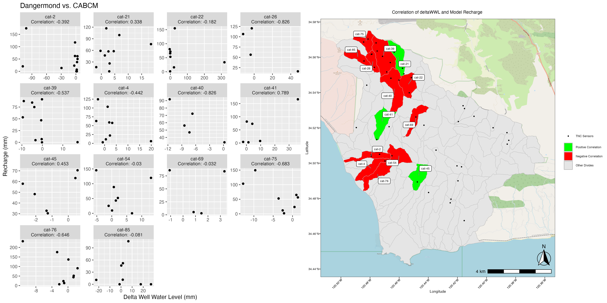
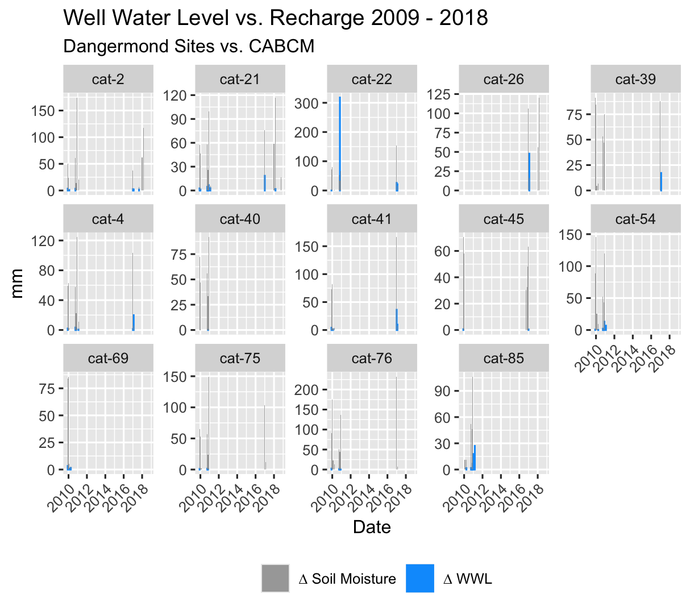

<!-- README.md is generated from README.Rmd. Please edit that file -->

# WaterBalanceSummary

<!-- badges: start -->
<!-- badges: end -->

The goal of WaterBalanceSummary is to create water balance plots,
seasonal error plots, compare well water level with soil moisture from
aggregated meteorological data.

## Installation

You can install the development version of WaterBalanceSummary from
[GitHub](https://github.com/) with:

``` r
# install.packages("pak")
pak::pak("lynker-spatial/WaterBalanceSummary")
```

#### You can use this package to produce detailed figures for analysis of your model compared to real world data.



#### To visualize the water balance of a basin


#### And to locate where model data and real world data do and do not align


