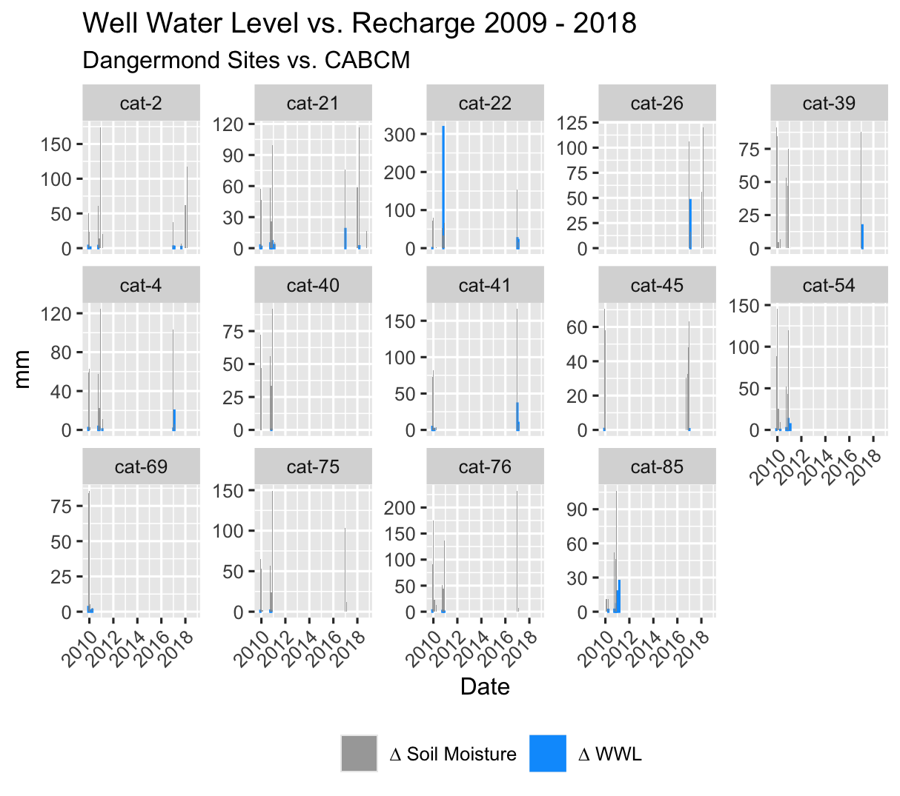
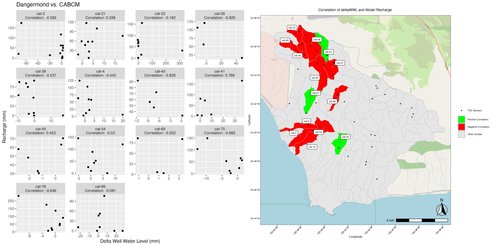

```{r, include = FALSE}
knitr::opts_chunk$set(
  collapse = TRUE,
  comment = "#>"
)
```

```{r setup}
library(WaterBalanceSummary)
```

This workflow is built to compare Modeled Soil Moisture Storage against
Observed Well Water Level.

Note: As of 9/2/2024 the package is formatted to process CABCM and
TerraClimate data. As NextGen data becomes available any adjustments
that need be made to allow it to work within this flow will be made.
Until that point, this document will refer to CABCM and TerraClim data
with the implication that NextGen could be substituted for either at any
point.

# **Comparing Model and Observed Soil Moisture, correlating the two, producing plots and maps for visualization.**

This workflow assumes access to the tnc-dangermond bucket and its
folders which contain the updated site data for the Dangermond Preserve.

Similar to [WaterBalance](docs/articles/WaterBalance.html), to start you
need Site Location and Basin Data

#### Site Data

The assumption is that you already have site data that fits this format:

{width="1097"}

#### Divides

You also need to bring in your Basin Divides for mapping purposes.


To get our data from the tnc-dangermond bucket we will need to pull the
parquet data from S3 and organize it into a list.

**Note**: If you already have your site data, and it is formatted like
the output of CleanWells(), you can skip straight to the Change In
Storage From the Model step.

Intersect the Site Data and Divides to get a dataframe of all your
divides with all the sites that they contain.

```{r}
#dangermond_sites <- st_intersection(All_Sites_sf, NewDivides)
```


#### Clean up the data a bit.

The TNC Site names get wonky so replacing any spaces with underscores,
filtering out NA values, and just pulling out the Site and Divide (to be
used later) fields will help. Active Divides will be used in the
CleanWells() function below.

Additionally, creating a SiteBasins df that is just the distinct Basin
IDs is necessary if you want to pull well data from the TNC Bucket.

```{r}
##Join Divides and Sites
#ActiveDivides <- dangermond_sites %>% 
#  filter(!is.na(SiteName)) %>% 
#  mutate(Site = str_replace_all(SiteName, "_", "")) %>% 
#  dplyr::select(Site, Divide, has_flowline)


#Site Basins
#SiteBasins <- ActiveDivides %>% 
#  dplyr::select(Divide) %>% 
#  distinct(Divide)
```

### Clean Well Data

CleanWells()

For this example I will be using "all_combined_data" which is compiled
from the TNC Sensor data at the Jack and Laura Dangermond Preserve. If
you have the correct credentials you can pull this data as well, to do
so you will need the SiteBasins df created above.

```{r}
#monthly_basin_average <- CleanWells(x = all_combined_data, y = ActiveDivides)
```

This function filters, transforms, and processes well water level data
from a combined dataset. It prepares the data for mapping and analysis
by calculating changes in well water levels, joining with basin
information from ActiveDivides, and summarizing the data on a monthly
basis.

The output should look like this, time series data for all divides
containing sites that are measuring well water level, and the average
change in well water level from month to month:


After Running CleanWells() you should also create a UniqueDivides
dateframe

This will be used in the next function as well.

```{r}
#  UniqueDivides <- monthly_basin_average %>%
#    distinct(Divide)
```

### Change In Storage From the Model

Now that we have the site data, we can use the (model)\_delta_str file
from the WaterBalance workflow and compare the two.

#### Join Hydro Data

The JoinHydroData() function merges well water level data with change in
storage data from our models for further analysis. The storage data is
filtered to include only non-negative values and specific date ranges.
The function limits the data to basins present in the `UniqueDivides`
dataset.

```{r}
#cabcm_dangermond_join <- JoinHydroData(x = cabcm_delta_str, y = monthly_basin_average, z = UniqueDivides)

```

#### Correlation

Next you can use the Correlation() function, which computes the
correlation between changes in well water levels and modelled change in
storage for each divide (basin). It calculates standard deviations of
well water levels and storage, computes correlation coefficients, and
merges these correlations back into the original dataset.

```{r}
#cabcm_corr_join <- Correlation(x = cabcm_dangermond_join)
```

The output should look like this, it even adds convenient plot titles!


I've called this dataframe "cabcm_corr_join", no need to get too fancy.

Now that our data is looking good we can finally make some plots

Plot_WWLvsSTR() does exactly what you think it will. It plots the change
in well water level "mean_change_mm" against deltaSTR from your model
data.

```{r}
#cabcm_Plot <- Plot_WWLvsSTR(x = cabcm_corr_join)

#cabcm_Plot
```



This is a great visualization of the accuracy of the model to the basin
in terms of both timing and magnitude of changes in well water level vs
modeled changes in soil moisture.

If we want more detail, making a scatterplot of the two should help, and
we can then attach that to a map to make it an even more powerful visual
aid.

### ModelScatter()

ModelScatter() uses the same data as above, but makes a scatterplot
instead.

```{r}
#ModelScatterPlot <- ModelScatter(x = cabcm_corr_join)

#ModelScatterPlot
```


This is good, it shows us the general shape of the data and the
correlation is easily visible as part of the title. But how does it
relate spatially to our basin?

ModelCorrMap() uses model_correlation_by_divide, which is an output of
Correlation() along with the scatter plot we just produced to create a
side-by-side plot of the two.

```{r}
#Corr_Map <- ModelCorrMap(x = cabcm_corr_join, y = ModelScatterPlot, z = NewDivides)
```


