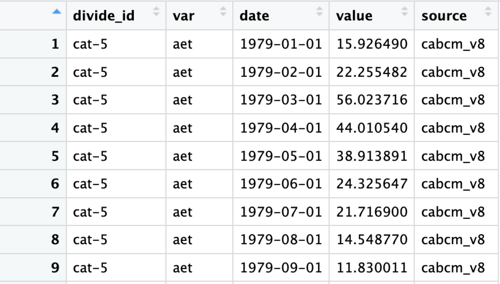

```{r, include = FALSE}
knitr::opts_chunk$set(
  collapse = TRUE,
  comment = "#>"
)
```

```{r setup}
library(WaterBalanceSummary)
```

Note: As of 9/2/2024 the package is formatted to process CABCM and
TerraClimate data. As NextGen data becomes available any adjustments
that need be made to allow it to work within this flow will be made.
Until that point, this document will refer to CABCM and Terra data with
the implication that NextGen could be substituted for either at any
point.

# **Creating WaterBalance and Percent Error By Season Plots**

# **Set AWS Credentials**

The first step will be to set AWS Credentials Globally so that you can
access the data held in the tnc-dangermond bucket.

#### **Define the Theme**

**Optional** Set a common theme for all of your plots. If you want them
to look like the examples here, you can use this code chunk:

```{r}
theme_pers <-function (base_size = 7, base_family = ""){
  theme(
    line = element_line(colour = "black", size = 0.3, linetype = 1, lineend = "butt"),
    rect = element_rect(fill = "white", colour = "black", size = 0.3, linetype = 1),
    text = element_text(family = base_family, face = "plain", colour = "black", size = base_size, hjust = 0.5, vjust = 0.5, angle = 0, lineheight = 0.9),
    axis.text = element_text(size = rel(0.8)),
    axis.line = element_blank(),
    axis.text.x = element_text(vjust = 1),
    axis.text.y = element_text(hjust = 1),
    axis.ticks = element_line(),
    axis.title.x = element_text(),
    axis.title.y = element_text(angle = 90),
    axis.ticks.length = unit(1, "mm"),
    axis.ticks.margin = unit(1, "mm"),
    legend.background = element_rect(colour = NA),
    legend.spacing = unit(-0.5, "lines"),
    legend.key = element_blank(),
    legend.key.size = unit(1.2, "lines"),
    legend.key.height = NULL,
    legend.key.width = NULL,
    legend.text = element_text(size = rel(0.8)),
    legend.text.align = NULL,
    legend.title = element_text(size = rel(0.8), hjust = 0),
    legend.title.align = 0.5,
    legend.position = "right",
    legend.direction = NULL,
    legend.justification = "center",
    legend.box = NULL,
    panel.background = element_rect(colour = NA),
    panel.border = element_rect(fill = NA),
    panel.grid.major = element_line(colour = "grey90", size = 0.2),
    panel.grid.minor = element_blank(),
    panel.margin = unit(0.25, "lines"),
    panel.margin.x = NULL,
    panel.margin.y = NULL,
    strip.background = element_blank(),
    strip.text = element_text(face="bold"),
    strip.text.x = element_text(face="bold"),
    strip.text.y = element_text(face="bold", angle = -90),
    plot.background = element_rect(colour = "white"),
    plot.title = element_text(size = rel(1.2)),
    plot.margin=unit(rep(1, 4), "mm"),
    complete = TRUE)
}

```

#### **Site Data**

The assumption is that you already have site data that fits this format:


#### **Divides**

You also need to bring in your Basin Divides layer for mapping purposes.


#### **Pull Model Data**

The data pulls assume access to the tnc-dangermond bucket and its
folders which contain the updated model data for the Dangermond
Preserve.

#### **Pull CABCM Data**

```{r}
#new_cabcm_data <- CABCMParquetRead()
```

The CABCMParquetRead() function lists all Parquet files in the specified
subfolder within the base folder, it then reads each parquet file into a
data frame, stores them in a list, and combines all data frames in the
list into a single data frame with an additional column \`file\`
indicating the file from which each row was read.

The end product should look like this:


#### **Pull TerraClimate Data**

```{r}
#new_terraclim_data <- TerraParquetRead()
```

The TerraClimParquetRead function performs the same steps as the
CABCMParquetRead() function with the added step that it transforms the
\`var\` column to standardize variable names, changing "q" to "run" and
"soil" to "str"

#### **Clean Model Data**

The above data has a variable, str, which represents soil moisture
storage. To accurately balance the basin's water budget, we need to
convert this from total storage to the change in storage between two
time steps.

model_clean() separates out the soil moisture storage "str" from the
"var" field and calculates day to day change in storage before joining
that data back into the primary dataset for analysis. Assign your ouput to [model name]_delta_str

```{r}
#cabcm_delta_str <- model_clean(new_cabcm_data)
```

From this:

{width="425"}

To this:

{width="427"}

#### **Process Model Data**

What we have so far is great, but it isn't accounting for error. If the
input to our system is Precipitation, PPT, and the out puts are Actual
Evapotranspiration, Stream Recharge, Runoff, and Change in Soil Moisture
Storage, we can better balance our system by finding error with the
following equation.

ERR = ppt - aet - rch - run - str

```{r}


#result_cabcm <- process_model_data(cabcm_delta_str, NewDivides)

```

The process_model_data() function does this and more.

It widens the dataframe, calculates the error for each timestamp,
assigns seasons based on month, calculates average error per season, and
the percent error against PPT. It then joins the seasonal data with the
`NewDivides` dataset to create a spatial dataframe, which is split into
four seasonal datasets. The final output is a list containing seasonal
data that can be used for generating Percent Error Plots based on the
season.


#### **Plot Seasons**

plot_seasons() generates standardized plots for based on the above
seasonal data. The plots visualize the percent error across different
spatial features for a given season. This function is designed to be
used within the `GridSeasons()` function to arrange the plots in a grid
layout.

You can customize it as suits you, but I have found this format to be
very appealing visually.

```{r}
PlotSeason <- function(SeasonData, season_name) {
  ggplot() +
    annotation_map_tile(type = "osm", zoomin = 1) +
    coord_sf(crs = st_crs(26910)) +
    ggtitle(glue("{season_name}")) +  # Use the season name for the title
    geom_sf(data = filter(SeasonData, type != "coastal"), color = "grey", aes(fill = percent_error)) +
    labs(fill = "Percent Error") +
    scale_fill_gradient(low = "white", high = "red4") + 
    theme(axis.text.x = element_text(angle = 45, hjust = 1),
          plot.title = element_text(face = "bold"),
          plot.subtitle = element_text(hjust = 0.5))
}
```

#### **Seasons Plot**

```{r}
#SeasonsPlot <- GridSeasons(result_cabcm)
```

GridSeasons() arranges and formats seasonal plots generated by the
`PlotSeason` function into a 2x2 grid layout. It uses the output from
`process_model_data()` and customizes the plot titles and captions based
on the data source, be it CABCM, Terra, or (pending) NextGen


### **Wide Data()**
We need to make the data wide before we can balance it and use it to create our water balance plot.
This can be done with the widen_model_data() function


```{r}
#cabcm_data_wide <- widen_model_data(cabcm_delta_str)
```

use cabcm_delta_str as the x value and feed the output right into balance_data() below

#### **Balance Data()**

balance_data() relies on terra\_ or cabcm_data_wide from the
process_data() function above. It formats the data so that it can be
used to create the Water Balance Plots.

The new data should look like this:


#### **Water Balance Plots**

CreateWaterBalancePlot() uses the output of balance_data(), terra\_ or
cabcm_long_balance, and creates a water balance plot comparing the
inputs and outputs of the system.

```{r}
#combined_plot <- CreateWaterBalancePlot(x = terra_long_balance)
```


